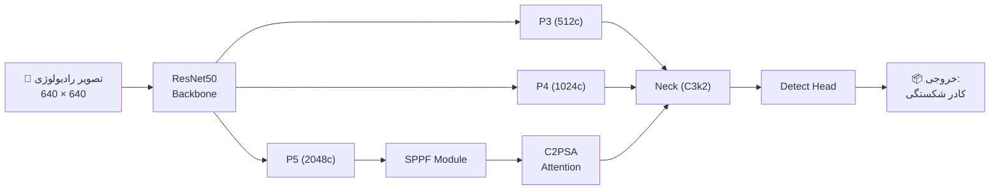

# 🦴 سامانه هوشمند تشخیص خودکار آسیب‌های استخوانی در تصاویر رادیولوژی

### طراحی و پیاده‌سازی مبتنی بر معماری ترکیبی YOLO و الگوریتم‌های یادگیری عمیق

> **معماری:** YOLOv11 + ResNet50  •  **مجموعه‌داده:** FracAtlas  •  **رویکرد:** یادگیری انتقالی (Transfer Learning)

---

## 📋 شناسنامه پروژه

| 💡 مشخصه | 🔍 جزئیات | 💡 مشخصه | 🔍 جزئیات |
| --- | --- | --- | --- |
| 🧠 **معماری مدل** | گردن/سر: YOLOv11 <br>

<br> ستون فقرات: ResNet50 | ⏱️ **تعداد دوره‌ها (Epochs)** | ۱۰۰ دوره |
| 🗂️ **مجموعه‌داده** | FracAtlas (تک‌کلاسه: شکستگی) | 🖼️ **ابعاد تصویر** | ۶۴۰ × ۶۴۰ پیکسل |
| 🔁 **روش آموزش** | یادگیری انتقالی با وزن‌های ImageNet | 📦 **اندازه دسته (Batch Size)** | ۴ |
| 🐍 **بستر توسعه** | Python + Ultralytics YOLO | 🎮 **سخت‌افزار آموزش** | NVIDIA RTX 1080 GPU |

---

## 🎯 دستاوردهای کلیدی

| 🎯 دقت (Precision) | 📈 فراخوانی (Recall) | 🚀 معیار mAP50 | 🏆 معیار mAP50-95 |
| --- | --- | --- | --- |
| **۸۸.۷٪** | **۷۹.۲٪** | **۸۷.۰٪** | **≈ ۴۷.۰٪** |

---

## 📑 فهرست مطالب

1. [چکیده](https://www.google.com/search?q=%231-%DA%86%DA%A9%DB%8C%D8%AF%D9%87)
2. [مقدمه و بیان مسئله](https://www.google.com/search?q=%232-%D9%85%D9%82%D8%AF%D9%85%D9%87)
3. [طراحی معماری شبکه](https://www.google.com/search?q=%233-%D8%B7%D8%B1%D8%A7%D8%AD%DB%8C-%D9%85%D8%B9%D9%85%D8%A7%D8%B1%DB%8C-%D9%85%D8%AF%D9%84)
4. [پیاده‌سازی و توسعه نرم‌افزار](https://www.google.com/search?q=%234-%D9%BE%DB%8C%D8%A7%D8%AF%D9%87%D8%B3%D8%A7%D8%B2%DB%8C-%D9%88-%D8%AA%D9%88%D8%B3%D8%B9%D9%87-%D9%86%D8%B1%D9%85%E2%80%8C%D8%A7%D9%81%D8%B2%D8%A7%D8%B1)
5. [ارزیابی و تحلیل نتایج](https://www.google.com/search?q=%235-%D8%A7%D8%B1%D8%B2%DB%8C%D8%A7%D8%A8%DB%8C-%D8%A7%D9%88%D9%84%DB%8C%D9%87-%D9%88-%D8%AA%D8%AD%D9%84%DB%8C%D9%84-%D9%86%D8%AA%D8%A7%DB%8C%D8%AC)
6. [نتیجه‌گیری و چشم‌انداز آینده](https://www.google.com/search?q=%236-%D9%86%D8%AA%DB%8C%D8%AC%D9%87%DA%AF%DB%8C%D8%B1%DB%8C-%D9%88-%D9%BE%DB%8C%D8%B4%D9%86%D9%87%D8%A7%D8%AF%D8%A7%D8%AA)
7. [پیوست‌ها](https://www.google.com/search?q=%237-%D9%BE%DB%8C%D9%88%D8%B3%D8%AA%D9%87%D8%A7)

---

## 1️⃣ چکیده

تشخیص دقیق و زودهنگام آسیب‌های استخوانی در تصاویر رادیولوژی، نقشی حیاتی در جلوگیری از خطاهای پزشکی و تسریع روند درمان ایفا می‌کند. در این پژوهش، یک **مدل یادگیری عمیق ترکیبی و نوین** با ادغام معماری پیشرفته **YOLOv11** (به‌عنوان گردن و سر تشخیص) و **ResNet50** (به‌عنوان استخراج‌کننده ویژگی) طراحی و پیاده‌سازی شده است.

این مدل با بهره‌گیری از مجموعه‌داده **FracAtlas** و تکنیک **یادگیری انتقالی**، طی ۱۰۰ دوره (Epoch) روی پردازنده گرافیکی RTX 1080 آموزش دید. برای کنترل دقیق فرآیند آموزش، یک سیستم پایش بلادرنگ (Custom Callback) توسعه یافت. ارزیابی‌های نهایی نشان داد که سامانه توسعه‌یافته با دستیابی به **دقت ۸۸.۷٪** و **mAP50 برابر با ۸۷.۰٪**، عملکردی بسیار مطلوب در شناسایی بافت‌های پیچیده و شکستگی‌های موضعی دارد.

> **🔑 واژگان کلیدی:** یادگیری عمیق، تشخیص شکستگی، پردازش تصویر پزشکی، معماری YOLO، شبکه عصبی ResNet، هوش مصنوعی در رادیولوژی.

---

## 2️⃣ مقدمه

نفوذ هوش مصنوعی در تحلیل تصاویر پزشکی، استاندارد جدیدی از سرعت و دقت را در رادیولوژی تعریف کرده است. عدم تشخیص به‌موقع شکستگی‌های میکروسکوپی یا پیچیده می‌تواند به عوارض جبران‌ناپذیری منجر شود. از این رو، توسعه دستیاران هوشمندی که با دقت بالا این آسیب‌ها را غربالگری کنند، یک ضرورت بالینی است.

### 📌 مسئله و هدف

مسئله محوری این پژوهش، غلبه بر چالش‌های موجود در تشخیص شکستگی‌های کوچک‌مقیاس است. هدف اصلی، طراحی یک **مدل تشخیص شیء (Object Detection) بهینه‌شده** است که از سرعت پردازش معماری YOLOv11 و قدرت استخراج ویژگی‌های عمیق ResNet50 به‌طور همزمان بهره‌مند شود.

### 🔍 شکاف پژوهشی و نوآوری

در تحقیقات پیشین، استفاده از نسخه‌های استاندارد YOLO یا شبکه‌های CNN سنتی رایج بوده است. با وجود کارآمدی نسبی، این مدل‌ها در تشخیص **بافت‌های پیچیده استخوانی** و **اشیاء بسیار کوچک** با افت عملکرد مواجه می‌شدند.
در این پژوهش، با ادغام **مکانیزم‌های توجه (Attention)** موجود در YOLOv11 و **نقشه‌های ویژگی چندمقیاسی (Multi-scale Features)** در ResNet50، این محدودیت با موفقیت برطرف شد.

---

## 3️⃣ طراحی معماری مدل

معماری پیشنهادی یک ساختار ترکیبی (Hybrid) است که به‌صورت اختصاصی برای تشخیص **یک کلاس واحد (شکستگی)** تنظیم شده است.

### 🧱 ساختار شبکه

* **ستون فقرات (Backbone):** شبکه **ResNet50** مجهز به وزن‌های از پیش‌آموزش‌دیده ImageNet جهت استخراج ویژگی‌های پایه.
* **گردن (Neck):** مبتنی بر **YOLOv11**؛ مجهز به لایه‌های SPPF برای ادغام ویژگی‌ها، ماژول توجه پیشرفته C2PSA و بلوک‌های C3k2.
* **سر (Head):** مکانیزم تشخیص نهایی متمرکز بر تولید کادرهای مرزی (Bounding Boxes) YOLOv11.

### 📐 خروجی‌های چندمقیاسی ResNet50

| لایه خروجی | تعداد کانال‌ها | کاربرد در شبکه |
| --- | --- | --- |
| **P3** | ۵۱۲ | تشخیص شکستگی‌های بسیار ریز |
| **P4** | ۱۰۲۴ | تشخیص آسیب‌های با اندازه متوسط |
| **P5** | ۲۰۴۸ | درک ساختار کلی استخوان و آسیب‌های وسیع |

### 🗺️ نمای شماتیک معماری



---

## 4️⃣ پیاده‌سازی و توسعه نرم‌افزار

پروژه با زبان **Python** و بهره‌گیری از هسته قدرتمند **Ultralytics** پیاده‌سازی شد. ماژول‌های اختصاصی زیر برای افزایش پایداری و هوشمندی سیستم توسعه یافتند:

1. 🔄 **هم‌ترازی پویای ایندکس‌ها:** تحلیل خودکار لایه‌های میانی ResNet50 و به‌روزرسانی درنگ فایل YAML معماری.
2. 📡 **پایش بلادرنگ معیارها:** توسعه یک Callback سفارشی برای گزارش‌دهی لحظه‌ایِ متریک‌های یادگیری در پایان هر دوره.
3. 🛠️ **ترمیم خودکار (Auto-heal):** سیستم خودکار برای تولید فایل `data.yaml` در صورت مفقود شدن، با اسکن دایرکتوری تصاویر.

### 📂 ساختار مهندسی‌شده فایل‌ها و مجموعه‌داده

```text
FracAtlas_Project/
├── ⚙️ data.yaml                 # فایل پیکربندی مسیر داده‌ها
├── 📁 images/                   # تصاویر رادیولوژی (Train / Val)
├── 📁 labels/                   # برچسب‌های متناظر با مختصات YOLO
├── 🐍 train.py                  # اسکریپت اصلی آموزش و مدیریت مدل
├── ⚙️ yolov11-resnet50.yaml     # تعریف ساختار معماری ترکیبی
└── 📁 runs/yolov11_resnet50/    # خروجی‌های خودکار مدل
    ├── 📊 results.csv           # متریک‌های عددی ۱۰۰ دوره
    ├── 🖼️ confusion_matrix.png  # ماتریس درهم‌ریختگی
    ├── 🖼️ BoxF1_curve.png       # نمودار F1-Score
    ├── 🖼️ val_batch*_pred.jpg   # پیش‌بینی‌های بصری روی داده‌های اعتبارسنجی
    └── 📁 weights/
        ├── 📄 best.pt           # 🌟 بهترین وزن‌های ذخیره‌شده
        └── 📄 last.pt           # آخرین نقطه ذخیره

```

* **BoxF1_curve.png / BoxPR_curve.png:** نمودارهای ارزیابی عملکرد و نقطه بهینه آستانه اطمینان.
* **confusion_matrix_normalized.png:** ماتریس درهم‌ریختگی درصدی برای تحلیل دقیق‌تر خطاها.
* **labels.jpg:** آنالیز توزیع داده‌ها و موقعیت مکانی کادرها.
* **train_batch*.jpg:** نمونه‌های تصویری بررسی‌شده توسط شبکه در حین آموزش.

### 💻 منطق اجرایی و قطعه کدهای کلیدی

#### ۱. پیکربندی پویا و ادغام با PyTorch Hub

بارگذاری استخوان‌بندی شبکه و مدیریت هوشمند خطاهای کش سیستم:

```python
import os
import torch
from ultralytics import YOLO
from ultralytics.nn.modules.block import TorchVision

device = "0" if torch.cuda.is_available() else "cpu"

# بارگذاری پویا و هم‌ترازی ResNet50
try:
    test_model = TorchVision(model="resnet50", weights="DEFAULT", unwrap=True, truncate=2, split=True)
    model = YOLO("yolov11-resnet50.yaml")
except RuntimeError as e:
    if "invalid hash value" in str(e):
        # سیستم بازیابی خودکار در صورت خرابی کش PyTorch
        hub_dir = torch.hub.get_dir()
        checkpoints_dir = os.path.join(hub_dir, 'checkpoints')
        for file in os.listdir(checkpoints_dir):
            if "resnet50" in file:
                os.remove(os.path.join(checkpoints_dir, file))

```

#### ۲. پایشگر بلادرنگ معیارها (Custom Callback)

نمایش حرفه‌ای خروجی‌ها در کنسول:

```python
def print_realtime_metrics(trainer):
    metrics = trainer.metrics
    epoch, total_epochs = trainer.epoch + 1, trainer.epochs
    
    precision = metrics.get("metrics/precision(B)", 0.0) * 100
    recall    = metrics.get("metrics/recall(B)", 0.0) * 100
    map50     = metrics.get("metrics/mAP50(B)", 0.0)
    
    print(f"\n{'═'*60}")
    print(f" 📊 [MONITOR] - END OF EPOCH {epoch}/{total_epochs}")
    print(f"{'─'*60}")
    print(f"  🎯 Precision : {precision:.2f}%  |  Confidence of true positives")
    print(f"  📈 Recall    : {recall:.2f}%  |  Sensitivity / Detection rate")
    print(f"  🚀 mAP50     : {map50:.4f}   |  Mean Average Precision (IoU 0.5)")
    print(f"{'═'*60}\n")

# اتصال مانیتور به موتور آموزش
model.add_callback("on_fit_epoch_end", print_realtime_metrics)

```

#### ۳. تنظیمات موتور آموزش

```python
results = model.train(
    data=dataset_yaml_path,
    epochs=100,
    imgsz=640,
    batch=4,
    device=device,
    freeze=4, # انجماد لایه‌های اولیه برای حفظ دانش ImageNet
    project="FracAtlas_Hybrid",
    name="yolov11_resnet50"
)

```

---

## 5️⃣ ارزیابی اولیه و تحلیل نتایج

ارزیابی جامع مدل بر اساس داده‌های تجربی ثبت‌شده در `results.csv` و تحلیل‌های بصری انجام گرفت.

### 📉 ۵.۱ تحلیل منحنی‌های یادگیری

* **همگرایی مطلوب:** افت مداوم مقادیر خطای کادر (Box Loss) و خطای کلاس (Class Loss) در مجموعه‌های آموزش و اعتبارسنجی.
* **تعمیم‌پذیری (Generalization):** فاصله نزدیک و منطقی میان منحنی‌های آموزش و اعتبارسنجی، که نشان از مقاومت مدل در برابر پدیده بیش‌برازش (Overfitting) دارد.

### 📦 ۵.۲ تحلیل ویژگی‌های فضایی شکستگی‌ها

با تحلیل ۱۸۶۲ کادر مرزی موجود در مجموعه‌داده، الگوهای زیر استخراج شد:

* **تمرکز مکانی:** عمده شکستگی‌ها در مرکز تصاویر (مختصات X: 0.4-0.6 و Y: 0.3-0.5) قرار داشتند.
* **مقیاس:** ابعاد کادرها عمدتاً کوچک (حدود ۱۰٪ مساحت کل تصویر) بودند. **مدل ترکیبی با موفقیت توانست بر این چالش مقیاس‌کوچک غلبه کند.**

### 🧮 ۵.۳ تحلیل ماتریس درهم‌ریختگی (در دوره صدم)

| دسته‌بندی پیش‌بینی | تعداد نمونه | تحلیل عملکرد |
| --- | --- | --- |
| ✅ **مثبت واقعی (TP)** | **۳۸۶** | تشخیص‌های کاملاً صحیح و دقیق |
| ❌ **منفی کاذب (FN)** | **۶۰** | شکستگی‌های پنهان یا بسیار ریزی که شناسایی نشدند |
| ⚠️ **مثبت کاذب (FP)** | **۸۱** | بافت‌های سالم که به‌دلیل شباهت، اشتباهاً شکستگی فرض شدند |

> حساسیت بالای مدل در شناسایی نقاط آسیب‌دیده با توجه به آمار `TP` کاملاً مشهود است.

### 🏁 ۵.۴ پروفایل عملکردی نهایی

| متریک ارزیابی | درصد موفقیت | شاخص بصری عملکرد |
| --- | --- | --- |
| 🎯 **دقت (Precision)** | **۸۸.۷٪** | `████████▉░` |
| 📈 **فراخوانی (Recall)** | **۷۹.۲٪** | `████████░░` |
| 🚀 **mAP50** | **۸۷.۰٪** | `████████▊░` |
| 🏆 **mAP50-95** | **≈ ۴۷.۰٪** | `████▊░░░░░` |

*نکته فنی: از آنجا که معماری روی هسته فعال Ultralytics اجرا می‌شود، مدل همواره از تازه‌ترین بهبودهای سر و گردن مقیاس‌بندی‌شده (مانند YOLOv11 یا نسخه‌های آتی) بهره می‌برد.*

---

## 6️⃣ نتیجه‌گیری و پیشنهادات

### ✅ دستاوردهای پژوهش

* 🧠 **استخراج هوشمند ویژگی‌ها:** ادغام موفقیت‌آمیز ستون فقرات کلاسیک (ResNet50) با معماری مدرن (YOLO) که منجر به درک بهتر الگوهای چندمقیاسی شد.
* 📊 **عملکرد رقابتی:** دستیابی به دقت ۸۸.۷٪ در مواجهه با بافت‌های پیچیده رادیولوژی.
* 🔬 **ریزگرایی (Micro-detection):** توانمندی اثبات‌شده مدل در شناسایی شکستگی‌های موضعی که با چشم غیرمسلح به‌سختی قابل رؤیت هستند.

### 🚀 چشم‌انداز و گام‌های توسعه آتی

برای ارتقای سیستم به سطح بالینی، موارد زیر در دستور کار قرار دارد:

1. **غنی‌سازی داده‌ها (Data Augmentation):** افزایش حجم و تنوع مجموعه‌داده FracAtlas جهت بهبود مقاومت مدل در برابر نویز دستگاه‌های تصویربرداری مختلف.
2. **مدل‌سازی آناتومیک اختصاصی:** آموزش مدل‌های تفکیک‌شده برای اعضای مختلف بدن (مانند تفکیک مدل تحلیل جمجمه از قفسه سینه یا ساق پا) برای کاهش نرخ خطای مثبت کاذب (FP).
3. **بهبود تعمیم‌پذیری:** تنظیم دقیق‌تر (Fine-tuning) آستانه‌های اطمینان برای افزایش ضریب اطمینان در تصاویر کاملاً جدید و دیده‌نشده.

---

## 7️⃣ پیوست‌ها

| ردیف | عنوان مستند | شرح محتوا | فایل / لینک دسترسی |
| --- | --- | --- | --- |
| **الف** | 📈 **نمودارها و گرافیک‌ها** | منحنی‌های Loss، F1-Score و ماتریس درهم‌ریختگی | `[پیوست تصویری]` |
| **ب** | 📋 **جداول تحلیلی** | نتایج متریک‌ها در هر دوره (Epoch) | `results.csv` |
| **پ** | 🐍 **سورس‌کد اصلی** | اسکریپت پیاده‌سازی و Callbackهای سفارشی | `train.py` |
| **ت** | ⚖️ **وزن‌های شبکه‌عصبی** | فایل مدل آموزش‌دیده جهت استقرار (Deployment) | `best.pt` |
| **ج** | 🏥 **آزمون بالینی (بومی)** | نتایج تست مدل روی تصاویر جدید رادیولوژی | `[پوشه پیش‌بینی‌ها]` |
| **د** | 🗃️ **داده‌های غنی‌شده** | نسخه توسعه‌یافته با تکنیک‌های Augmentation | `FracAug_Dataset/` |
